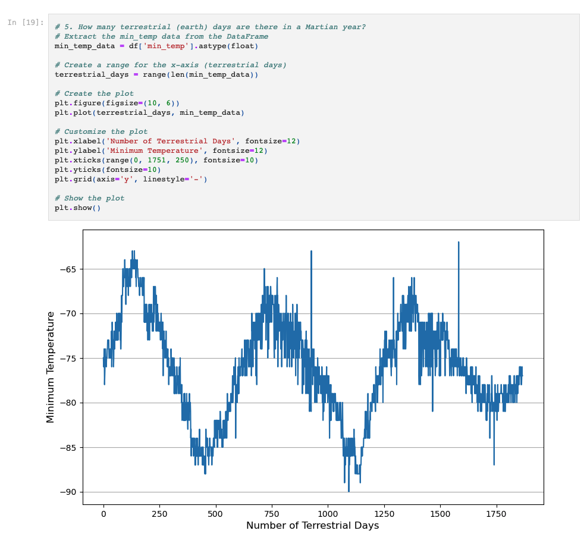

# Data-Collection

For this assignment, I used my skill of data scraping to obtain the neccessary information from websites to display titles and text of articles relating to Mars and analyze Mars weather patterns.

I used previous coursework and the Xpert Learning Assistant to complete the assignment.

